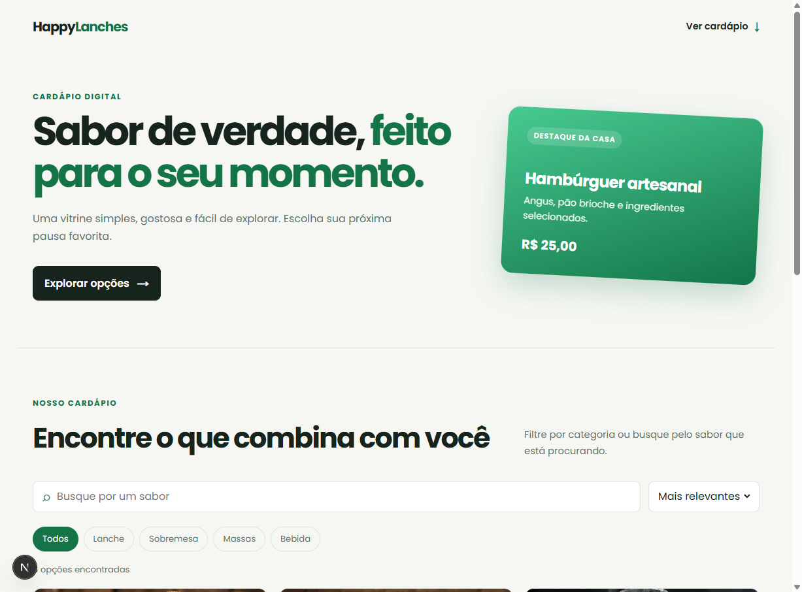
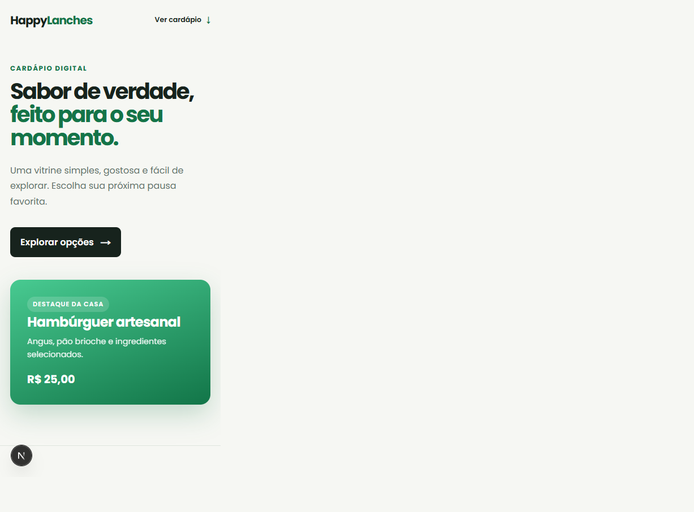

# HappyLanches

> Uma releitura do meu primeiro projeto front-end.

O HappyLanches nasceu em 2023 como um exercício de Flexbox: uma página estática de cardápio, feita com HTML e CSS. Esta versão preserva essa história e reconstrói a ideia com a experiência que desenvolvi depois — dados organizados, componentes reutilizáveis, busca, filtros, acessibilidade, testes e integração contínua.

## O que mudou

| Antes — v1 (2023) | Depois — v2 (atual) |
| --- | --- |
| HTML e CSS estáticos com cards repetidos | Next.js, React e TypeScript com catálogo orientado a dados |
| Flexbox e responsividade básica | Layout responsivo refinado para desktop e mobile |
| Ícone de carrinho sem ação | Busca, filtros de categoria e ordenação reais |
| Imagens sem textos alternativos | Semântica, foco por teclado, `alt` e metadados |

A implementação original continua preservada na tag [`v1.0.0-original`](https://github.com/Bruno-Piter/Happy-lanches/tree/v1.0.0-original) e no commit [`a0aa552`](https://github.com/Bruno-Piter/Happy-lanches/commit/a0aa552). As referências de mídia da primeira versão estão registradas em [`docs/evidence/v1`](docs/evidence/v1/README.md).

## Prévia





## Funcionalidades

- Busca por nome, descrição e categoria
- Filtros por tipo de produto e ordenação
- Catálogo tipado e centralizado em `src/data/menu.ts`
- Imagens otimizadas com `next/image`
- Interface acessível e navegável por teclado
- Testes unitários para a lógica do catálogo e CI no GitHub Actions

## Tecnologias

Next.js 16, React 19, TypeScript, CSS e Vitest.

## Executar localmente

```bash
npm install
npm run dev
```

Abra [http://localhost:3000](http://localhost:3000). Antes de enviar alterações, execute:

```bash
npm run lint
npm run typecheck
npm test
npm run build
```

## Estrutura

```text
src/app/              # página, metadados e estilos globais
src/components/       # componentes de interface
src/data/menu.ts      # conteúdo editável do cardápio
src/lib/catalog.ts    # busca, filtro, ordenação e preço
tests/                # testes unitários
docs/evidence/        # registros do antes e depois
```

## Mídias históricas

Os screenshots e vídeos publicados no README original permanecem acessíveis pelas URLs registradas em [`docs/evidence/v1/README.md`](docs/evidence/v1/README.md). Eles não foram incorporados ao Git porque os downloads dos anexos do GitHub não estão disponíveis de forma confiável neste ambiente.
